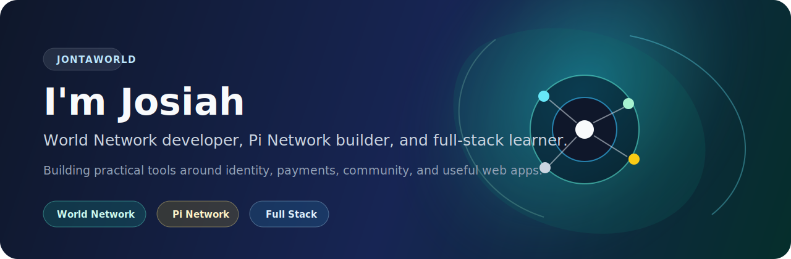
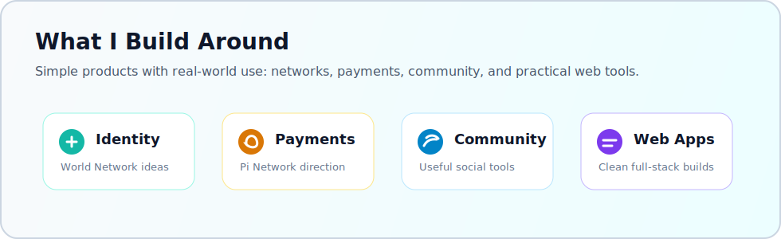

# I'm Josiah

I'm a developer building practical digital products around **World Network**, **Pi Network**, payments, community tools, and useful web applications.

My focus is simple: learn deeply, build consistently, and turn ideas into projects people can actually use.

## Professional Focus

- **World Network development:** identity-aware apps, user verification flows, and practical ecosystem ideas
- **Pi Network development:** payment-focused concepts, community utilities, and product experiments
- **Full-stack web development:** clean interfaces, APIs, backend logic, and maintainable project structure
- **Product thinking:** building tools that are useful, understandable, and ready to improve over time

## Technology

- Frontend: HTML, CSS, JavaScript
- Backend: Node.js, Express
- Tools: Git, GitHub, VS Code
- Growing into: full-stack architecture, API design, authentication, and production-ready workflows

## Current Direction

I'm sharpening my portfolio by building stronger, cleaner projects with real use cases. I care about products that connect people, make digital payments easier, support communities, and turn small ideas into working software.

## What Drives My Work

I like technology that feels practical. The best projects are not just code on a screen; they solve a problem, create access, or help someone move faster.

## Connect

- GitHub: [Jonta254](https://github.com/Jonta254)

**jontAWorld** is where I build, learn, and keep moving.
