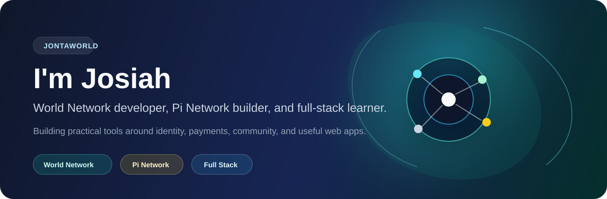

# Josiah Ontita — Builder on World Network

> *Turning real ideas into apps that verified humans actually use.*

I'm a full-stack developer focused on the **World Network** ecosystem — building identity-aware mini apps, community tools, and crypto-to-cash payment flows. My work sits at the intersection of blockchain access, everyday utility, and human verification.

---

## What I'm Building

| Project | Description | Stack |
|---|---|---|
| **[HumanChain](https://github.com/Jonta254/HumanChain)** | World Mini App — verified humans ask questions, join daily chains, vote on global verdicts, and read monthly human stories | Next.js · TypeScript · Supabase · World ID |
| **[WorldTMpesa](https://github.com/Jonta254/WorldTMpesa)** | Crypto ↔ M-Pesa exchange — sell or buy $WLD/USDC using KES via M-Pesa & Airtel Money | Node.js · Express · M-Pesa API |
| **[KIND Quest](https://github.com/Jonta254/KIND-Quest)** | Kindness-as-a-game — daily empathy missions, $WLD stakes, $KIND token rewards | HTML · JS · World Pay |
| **[Questora](https://github.com/Jonta254/Questora)** | Pi Network mainnet app — quests, streaks, badges, leaderboards, referrals | JavaScript · Pi SDK |

---

## Skills & Tools

**Frontend** — HTML · CSS · JavaScript · React · Next.js · Tailwind  
**Backend** — Node.js · Express · REST APIs  
**Data** — Supabase · PostgreSQL · Row-Level Security  
**Blockchain / Payments** — World ID · World Pay · MiniKit · M-Pesa Daraja API · Pi SDK  
**Tooling** — Git · GitHub · VS Code · Vercel

---

## What Drives the Work

The projects I care about most share a common thread: they require a **real human** on the other end. World ID lets me build that guarantee into the product from day one — no bots, no duplicate accounts, just verified people doing something meaningful together.

I'm drawn to problems where mobile money, crypto access, and community mechanics overlap. There are millions of people in East Africa and globally who are one useful app away from participating in the digital economy. That gap is where I build.

---

## Let's Work Together

I'm open to collaboration on:

- **World Mini Apps** — if you have an idea for a World ecosystem app and need a developer, reach out
- **Crypto ↔ Fiat integrations** — M-Pesa, Airtel, mobile money rails paired with crypto payments
- **Community or social tools** — leaderboards, voting systems, reputation mechanics
- **Freelance or contract work** — full-stack web development, API integrations, product builds from scratch

If any of that matches what you're working on, I'd genuinely like to hear from it.

📬 **brianokindo2022@gmail.com**  
🐙 **[github.com/Jonta254](https://github.com/Jonta254)**

---

*Building consistently. Shipping real things. Always learning.*
