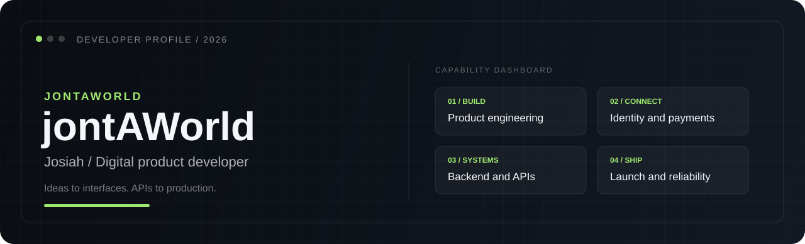

  

<h1 align="center">Josiah — Digital Product Developer</h1>

  I design and engineer dependable digital products across interfaces, APIs, identity, payments, and deployment.

  <a href="https://jontaworld.com"><strong>Portfolio</strong></a> ·
  <a href="mailto:jontaworld@gmail.com"><strong>Email</strong></a> ·
  <a href="https://github.com/Jonta254?tab=repositories"><strong>Repositories</strong></a>

## About

I turn early-stage ideas into clear, responsive, production-ready applications. My work spans product thinking, interface design, full-stack development, third-party integrations, testing, and launch.

I am especially interested in products that connect digital identity and payments with useful everyday experiences. I care about the less-visible details that make software trustworthy: secure authentication, explicit permissions, verified payment states, accessible interfaces, and graceful failure recovery.

## Selected work

| Project | What it does | Engineering focus |
| --- | --- | --- |
| **[HumanChain](https://github.com/Jonta254/HumanChain)** | A World Mini App for verified questions, community chains, human stories, and local exchange. | Next.js, TypeScript, Supabase, World ID, MiniKit |
| **[WorldTMpesa](https://github.com/Jonta254/WorldTMpesa)** | Connects WLD and USDC transactions with M-Pesa and Airtel Money. | Node.js, Express, payment callbacks, transaction recovery |
| **[KIND Quest](https://github.com/Jonta254/KIND-Quest)** | A community experience built around daily kindness missions and World payment mechanics. | JavaScript, World Pay, engagement systems |
| **[Questora](https://github.com/Jonta254/Questora)** | A Pi Network quest app with streaks, badges, referrals, and leaderboards. | JavaScript, Pi SDK, progression systems |

More case studies and product work are available at **[jontaworld.com](https://jontaworld.com)**.

## Core capabilities

<table>
  <tr>
    <td width="50%" valign="top">
      <strong>Product engineering</strong>  
      User flows, responsive interfaces, design systems, full-stack applications, and maintainable implementation.
    </td>
    <td width="50%" valign="top">
      <strong>Payments and identity</strong>  
      Wallets, mobile money, World ID, provider callbacks, webhooks, verification, and safe transaction states.
    </td>
  </tr>
  <tr>
    <td width="50%" valign="top">
      <strong>Backend and data</strong>  
      APIs, authentication, PostgreSQL, Supabase, validation, permissions, and operational tooling.
    </td>
    <td width="50%" valign="top">
      <strong>Delivery and reliability</strong>  
      Testing, accessibility, technical documentation, production hardening, Vercel deployment, and recovery paths.
    </td>
  </tr>
</table>

## Technology

`TypeScript` · `JavaScript` · `React` · `Next.js` · `Node.js` · `Express` · `PostgreSQL` · `Supabase` · `HTML` · `CSS` · `Git` · `Vercel`

**Platforms and integrations:** World ID, MiniKit, M-Pesa Daraja, Pi SDK, REST APIs, wallets, and webhooks.

## How I work

- Start with the real user journey and the failure cases, not just the happy path.
- Keep interfaces legible, responsive, accessible, and purposeful.
- Treat authentication, permissions, and payment confirmation as product features.
- Ship with documentation, verification, and a clear path for continued iteration.

## Work with me

I am available for focused collaboration on full-stack products, World Mini Apps, payment and wallet integrations, APIs, MVPs, and production hardening.

If you are building something useful and need someone who can carry it from product thinking through deployment, **[send me an email](mailto:jontaworld@gmail.com)**.
